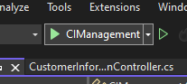

# Customer Information Management
**Author**  : Asyraf Dayan Bin Dzulkarnain
**Date**    : 5/4/2022

### Introduction
I am using a free MySQL database on [db4free.net](https://www.db4free.net/). Therefore expect some delay when using the API.
This project consists of **2** parts:
- API (**.NET**)
- Interface (**VueJS**)

### Required Downloads
- [.NET 6 SDK](https://dotnet.microsoft.com/en-us/download/dotnet/6.0)
- [Visual Studio 2022](https://visualstudio.microsoft.com/vs/)
- Vue 3 (v3.2.31 as of 5/4/2022)
- NPM (v8.5.5 as of 5/4/2022)

### .NET API Setup
> 1. Open the solution **CIManagement.sln** file located under ci-api with VS2022
> 2. Run the API with the button as shown below
> 3. 

### VueJS Setup
> 1. Open the ci-frontend folder with any code editor
> 2. In the terminal execute the command **npm install**
> 3. Open the file **store_states.js** located under ci-frontend/src/store/
> 4. Replace the baseURL port number with the one shown when running the API in the previous section
> 5. execute command **npm run serve**

### Login
> - In the login page, choose from 2 login credentials:
>    1. Username: S1, Password: S1 (Staff Login)
>    2. Username: M1, Password: M1 (Manager Login)
> - Managers have access to all the CRUD functions
> - Staff only has access to Read functions

### Lints and fixes files
>npm run lint --fix
